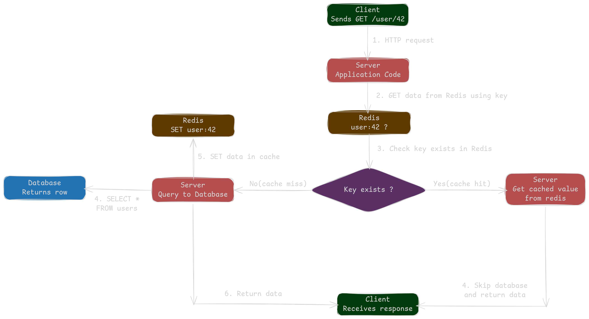
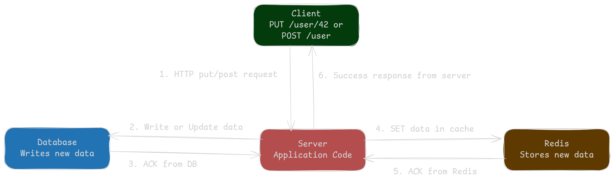
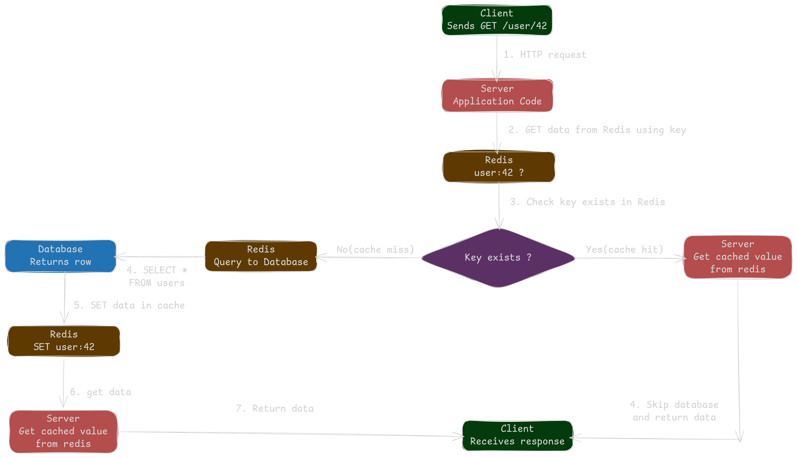
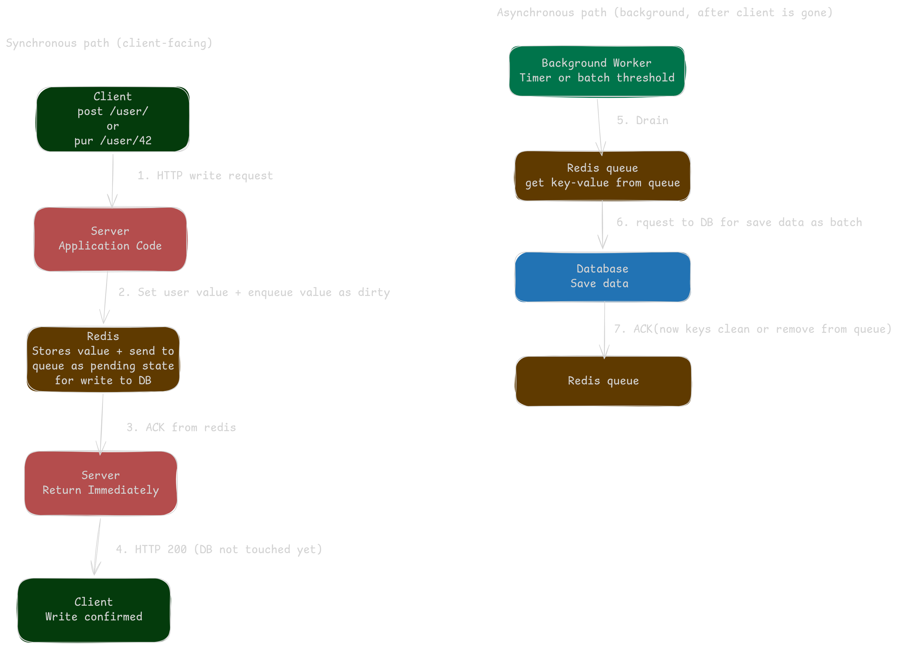

# The Complete Guide to Application Layer Caching Part 2: Caching Design Patterns

In [Part 1](#) we covered what application layer caching is, how it fits into distributed systems (private vs shared caches), the problems it solves, the trade offs to think about before building one, and the major types data, computation, session, and rate limiting.

Now we move to the real implementation question: how should the cache and the database actually work together?

There are several well-known patterns, each with its own trade-offs. Picking the right one depends on your read/write ratio, how fresh the data needs to be, and how much complexity you can afford.

---

## 1. Lazy Caching (Cache Aside)

Lazy caching is the most common pattern in backend systems. The application manages the cache directly, and data is loaded into the cache only when it's actually requested. That's why it's called *lazy* — nothing is cached until someone asks for it.

The workflow is simple. Say the app receives a request for the top 10 news stories. It first checks the cache. If the data is there — a cache hit — it returns immediately. If not — a cache miss — the app queries the database, stores the result in the cache, and returns it. The next request for the same data hits the cache and skips the database entirely.

This pattern works beautifully when data is read often but written rarely — user profiles, product catalogs, news feeds. A user profile might only be updated a few times a year but read hundreds of times a day, which is a perfect fit for lazy caching.

The big advantage is memory efficiency — only data that's actually requested ends up in the cache. It's also simple to implement, and if the cache fails, the app just falls back to the database.

The downside is that the first request for any item is slow since it has to go all the way to the database. You also need to handle invalidation yourself when the underlying data changes. One more thing to watch for in high-traffic systems: if many requests hit the same missing key at the same time, they'll all rush to the database at once. This is usually solved with distributed locks or single-flight patterns that ensure only one request fetches the data while the others wait.

---

## 2. Write Through

Write through is used in write-heavy systems. Every time data is written, it's applied to both the cache and the database at the same time. This keeps the cache perfectly in sync with the database — there's never a moment where the cache holds stale data.

The workflow is straightforward. When the app writes something, the write goes to the cache and the database together in a single operation. On future reads, the cache always has the latest value, so reads are fast and always accurate.

This pattern is useful when data must always be consistent between the cache and the database, and when reads happen frequently right after writes. A ticket booking system is a good example: if a seat gets booked, every subsequent read must reflect that immediately, or two customers could end up booking the same seat.

The main benefit is that the cache is never stale, and reads are fast right after the first write. The trade-off is that writes are slower because every write hits two systems instead of one. You can also fill the cache with data that gets written but never actually read, which wastes memory.

---

## 3. Read Through

Read through looks a lot like lazy caching from the outside, but there's one key difference: the **cache itself** is responsible for fetching missing data from the database — not the application. The app just asks the cache for data and trusts it to handle everything behind the scenes.

When the app requests data, the cache checks if it has it. If yes, it returns the data. If not, the cache itself talks to the database, loads the data, stores it, and returns it to the app. The application never has to write *check cache, else query DB* logic — the caching layer does it.

This pattern is great when you want to keep your application code clean and push all the data-loading logic into the caching layer.

The upside is simpler application code — no cache-miss handling scattered across your codebase. The downsides are that you need a more capable caching layer that knows how to load data from the source, and the first request for any item is still slow, just like lazy caching.

---

## 4. Write Behind (Write Back)

Write behind is the opposite of write through when it comes to speed. Writes go to the cache immediately and return success right away. The cache then asynchronously flushes those writes to the database in the background — usually in batches.

The workflow is fast by design. The app writes to the cache, the cache acknowledges instantly, and the app moves on. Meanwhile, the cache queues up writes and flushes them to the database at regular intervals or when a batch is full.

Use this pattern when write throughput is critical and you can tolerate a small risk of data loss. It's a great fit for workloads like logging, analytics events, counters, or metrics — anything high-volume where the exact moment of database persistence doesn't really matter.

The benefit is obvious: writes are extremely fast because the database isn't on the hot path, and batching reduces database load dramatically. The risk is that if the cache crashes before flushing its pending writes, that data is gone. Because of this, write-behind usually needs durable queues, replication, or a write-ahead log to make it safe in production.

---

     

## 5. Hybrid (Lazy Caching + Write-Through)

Most real production systems don't stick to a single pattern — they combine them. The hybrid pattern uses lazy caching for reads and write-through for writes. Reads load data into the cache on demand (cache aside), while writes update both the cache and the database together (write through).

This gives you the best of both worlds. Reads are memory-efficient because only requested data lives in the cache, and writes keep the cache automatically fresh, so there's never stale data after an update. It's especially useful for systems like ecommerce product pages where reads heavily dominate, but writes like inventory or price updates must reflect immediately.

The trade-off is complexity — you now have two patterns working together. Writes are also still slower than pure cache-aside since they have to update the cache and the database on every operation. But for balanced workloads with freshness requirements, hybrid is often the right call.

---

## 6. Versioned Cache Keys

Versioned cache keys take a completely different approach to the invalidation problem. Instead of trying to remove or refresh a cache entry when data changes, you include a version identifier — a timestamp, hash, or incrementing number — inside the cache key itself. When the data changes, a new key is generated, and the old entry simply becomes unreachable.

For example, in a content management system, an article might be cached under the key `article:456:20251018T0100`. When someone edits the article, the timestamp updates and the new key becomes `article:456:20251018T1430`. Readers automatically start hitting the new key, and the old version sits idle in memory until it expires on its own.

This pattern shines in distributed systems where coordinating cache invalidation across many nodes is a nightmare. Instead of broadcasting *evict this key* to every node, each node simply starts using the new versioned key the moment the version changes. No coordination needed.

The main benefits are that you don't need explicit invalidation logic, and the pattern works safely across distributed nodes without coordination overhead. Readers also never see half-updated data — they either hit the old version or the new version, never something in between. The downside is memory waste — old versioned entries stay in memory until they expire, which can add up quickly if data changes often. Your application also has to track and generate the correct version on every lookup, which adds some complexity.

---

## Which Pattern Should You Choose?

In practice, most production systems use **lazy caching (cache aside)** as the default because it's simple, safe, and fits the majority of read-heavy workloads. **Write through** comes in when consistency matters more than write speed. **Read through** is a nice fit when you're using a caching library that supports it out of the box and you want cleaner application code. **Write behind** is reserved for write-heavy workloads where raw speed outweighs durability guarantees. **Hybrid** combines lazy caching and write-through for balanced systems that need both fast reads and always-fresh data. And **versioned keys** are the go-to solution when you're running a distributed system and traditional invalidation becomes too painful to manage.

---

## Coming Up Next

The pattern you pick shapes a lot — read latency, write throughput, consistency, and how much invalidation logic you have to maintain. But picking a pattern is only half the work. Even the right pattern will fail in production if you mishandle two other things: **when data should expire**, and **what happens when the cache fills up**.

In **Part 3**, we'll cover TTLs, eviction policies (LRU, LFU), and the practical tuning lessons that turn a basic cache into a production-grade caching layer.

→ *Part 3: Cache Expiration, Eviction, and Production Tuning* (coming soon)
