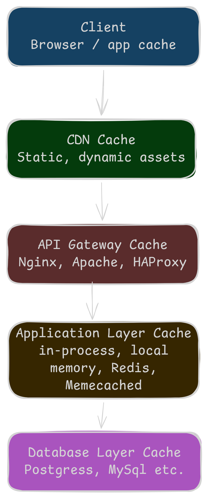
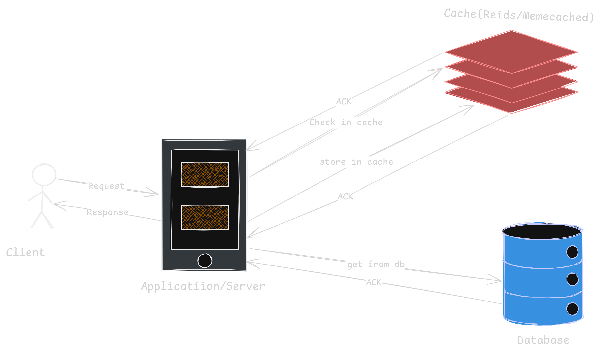

# Application Layer Caching

In my 6 years of backend engineering writing countless APIs, handling numerous services, and constantly optimizing response times, one tool has consistently proven indispensable: caching. I've used caching at many different layers, but in this article I want to focus specifically on application layer caching.

Users today demand speed instant search results, snappy dashboards, responsive interactions and every extra millisecond of latency translates to lost engagement and lost revenue. Yet a single request travels through the browser, network, load balancers, API gateways, application servers, and finally the database. If the same data is fetched the same long way on every call, the application simply cannot be fast. This is exactly the problem caching solves. a cache stores frequently requested data in fast storage (usually RAM) so subsequent requests are served instantly instead of recomputed or refetched.

Caching can be applied at many different layers of the stack. When a client makes a request, it travels through several stages, and each stage offers an opportunity to cache:

Browser cache: stores static assets and API responses on the client side, avoiding network calls entirely.
CDN cache: serves static content (images, scripts, stylesheets) from edge locations closest to the user.
API Gateway cache: caches responses at the gateway level, reducing load on backend services.
Application layer cache: stores computed results, session data, and frequently accessed objects in memory within the application itself.
Database cache: caches query results and frequently accessed rows to reduce disk I/O.

Each layer has its own trade-offs, use cases, and challenges. However, in this article I'll focus exclusively on the application layer cache the layer where, in my experience, backend engineers have the most control and where thoughtful caching decisions can deliver the biggest performance gains.

## What is Application Layer Caching?

Application layer caching is a technique where the application itself stores frequently accessed data in a fast storage location usually in memory so that it doesn't have to fetch or recompute the same data over and over again. Unlike caching at the browser, CDN, or database level, application layer caching lives inside your application code, giving backend engineers full control over what gets cached, when it expires, and how it's invalidated.

Application layer caching is most effective when your application repeatedly accesses the same data, especially when the original data source has one or more of these characteristics:

a. The data remains relatively static and doesn't change often.
b. The source (database, external API, etc.) is slow compared to in memory access.
c. The source is under a high level of contention, meaning many requests are hitting it at the same time.
d. The source is far from the application, so network latency adds up quickly.

imagine an ecommerce application where thousands of users view the same Top 10 Trending Products list on the homepage. This list doesn't change every second it might update once an hour. Without application layer caching, every single page load would run the same expensive database query. With cache, the application computes the list once, stores it in memory (or Redis/Memecached), and serves thousands of subsequent requests instantly without the database even knowing.

---

## Application Layer Caching in Distributed Systems

When your application runs as a single instance on a single server, application layer caching is straightforward just keep the data in memory. But modern applications rarely run that way. They run as multiple instances across multiple servers, often behind a load balancer, and sometimes split into many microservices. This is where things get complex and interesting.

In distributed applications, application layer caching is typically implemented using one of two strategies:

### Private Caching

A private cache is the most basic form of application layer caching it's an in memory store that lives inside the application process itself. Since the data sits right next to your code in RAM, access is extremely fast. However, the size of the cache is limited by the amount of memory available on the host machine.

When the data you want to cache exceeds the available RAM, you can fall back to local file storage. This is slower than memory but still much faster than making a network call to a remote database.

The main trade-off with private caching is consistency. Since each application instance holds its own copy of the data, two instances can end up with different snapshots. This means two identical requests hitting two different instances might return different results which can be confusing for users and dangerous for business logic.

Suppose you run three instances of a user service behind a load balancer. Instance A caches a user's profile at 10:00 AM. The user updates their name at 10:05 AM, and instance B refreshes its cache. But instance A still has the old name. Depending on which instance handles the next request, the user might see their new name or the old one.

### Shared Caching

Shared caching solves the consistency problem by moving the cache out of the application process and into a separate service typically Redis or Memcached. Every application instance reads from and writes to the same cache, so all instances see exactly the same data.

The biggest advantage of shared caching is scalability. Shared caches often run on server clusters that distribute data transparently across nodes. When you need more capacity, you simply add more servers to the cluster.

However, shared caching comes with two downsides:

Slower access: since the cache is no longer local to the application, every cache read requires a network call (still fast, but slower than in process memory).
Added complexity: you now have to set up, monitor, and maintain a separate caching service.

In real life many production systems use both a small private cache for ultra hot data and a shared cache for consistency across instances. This pattern is often called multi layer application caching.

---

## Which Problems Does Application Layer Caching Solve?

Application layer caching addresses several critical pain points in modern backend systems:

Faster API responses: Caching frequently accessed data inside the application can dramatically reduce API response times by serving results directly from memory instead of recomputing them or hitting the database.

Lower infrastructure costs: By avoiding expensive recomputation and redundant database calls, application layer caching reduces CPU and memory usage, letting teams handle more traffic with fewer resources.

Reduced database load: Most expensive database queries are repeated queries. By caching results at the application layer, you shield the database from unnecessary traffic and free it up for the work that actually requires it.

Better scalability without extra cost: Application layer caching lets systems absorb traffic spikes without a massive infrastructure upgrade, which is critical during marketing campaigns, product launches, or sudden viral traffic.

Protection from third-party failures: If your application depends on external APIs (payment gateways, weather services, geolocation, etc.), caching responses at the application layer can keep your system partially functional even when those external services are slow or down.

---

## Before You Build: What to Consider

Before jumping into implementation, there are a few important questions every backend engineer should answer. Thinking through these upfront will save you from painful refactors later.

### Is It Safe to Cache This Data?

Not all data is safe to cache. The same piece of information can be fine to cache in one place and dangerous in another. Think about an online store, on the checkout page, the price must be exactly correct serving an old cached price could charge the customer the wrong amount. But on the product listing page, a price that's a few minutes old is perfectly fine.

The rule is simple: cache data that is read often but rarely changes, like user profiles, product catalogs, and config settings. And never treat the cache as the only place your data lives caches can disappear or expire at any time, so the real source of truth must always be a permanent store like a database.

### Is Caching Effective for This Data?

Even when caching is safe, it's not always useful. Caching only helps when the same data is requested again and again. If your app reads thousands of different rows from a huge database and those rows keep changing, caching won't help much you'll rarely ask for the same row twice, and what you do cache will go stale quickly. Application layer caching works best when the same data is requested repeatedly within a short time window.

### Is the Data Structured Well for Caching?

Sometimes caching a single database record is enough. But often it's smarter to cache data in a combined form for example, a user record together with their order history as one ready to use object, so your app doesn't have to join them every time.

Also, since caches are key value stores, each piece of data is saved under a specific key. If your app needs to look up the same data in different ways like by user ID and by email you may need to store it under multiple keys.

### How Should You Load Data Into the Cache?

Two common approaches. With lazy loading, data is cached only when it's requested for the first time. All future requests come straight from the cache. This works well when you don't know in advance what will be needed. With seeding at startup, you fill the cache when the app starts good for static data or heavy computed results that are always needed.

For data that changes very fast and isn't critical (like view counts or trending scores), you can even store it directly in the cache and skip the database trading durability for speed.

### How Do You Handle Concurrency?

When many users update the same cached data at once, you need a strategy to avoid wrong data or lost updates. The optimistic approach assumes collisions are rare before writing, you check whether the data has changed. if not, the write goes through. It's fast and great for low conflict cases. The pessimistic approach locks the data during an update so no one else can touch it. It prevents all conflicts but slows things down, so use it only for short, high-collision operations.

### How Do You Maintain Consistency?

Distributed caches like Redis prioritize availability over strong consistency they don't guarantee every instance sees the very latest value. For most data, this is fine. But for information that must be accurate like checkout prices or stock availability use very short TTLs or skip the cache and go straight to the database.

### What About Availability and Scale?

Caches can fail a Redis server might crash, or the cache might be cold after a restart. Your app should always fall back to the original data store if the cache is unavailable.

For best results, combine a private cache (fast, local to each instance) with a shared cache (slower, but consistent across instances). To scale further, use sharding (splitting data across servers), clustering (running multiple cache servers as a group), and replication (keeping copies for safety).

### What About Security?

A cache often holds sensitive information user profiles, session tokens, API responses so treat it like any other important data store. Use authentication so only trusted services can read or write. For finer control, partition the cache so services only see their own data, or encrypt sensitive fields. And always use SSL/TLS when the cache is accessed over a network, especially a public one.

---

## Application Layer Caching Challenges and How to Solve Them

Application layer caching brings huge benefits, but it also comes with its own set of problems. Let's look at the most common ones and how to handle them.

### Cache Invalidation and Stale Data

Knowing when to refresh or throw away cached data is famously one of the hardest problems in computer science. The tricky part is this: when the real data in the database changes, how do we make sure every cached copy gets updated too? If invalidation isn't handled properly, users end up seeing outdated information for example, an "In Stock" label on a product that already sold out.

To solve this, we can pair TTLs with event driven invalidation. Whenever data changes in the database, the system publishes an event usually through a message queue that tells all application instances to refresh or remove the affected keys. For data that changes very often, just keep the TTL short so the cache naturally stays fresh. And for really critical reads like checking inventory during checkout you can skip the cache entirely and go straight to the database.

### Cache Penetration

Sometimes users (or bots) repeatedly ask for data that doesn't exist. Since there's nothing to cache, every request slips past the cache and slams straight into the database. A common attack pattern is bots hitting an API with random invalid IDs so every single request becomes a cache miss.

The fix is a negative result cache instead of caching only real data, we also cache the fact that a key doesn't exist (for a short time). That way, the next time someone asks for the same invalid key, the answer comes from the cache instead of hitting the database.

### Cache Avalanche

This happens when many cached items expire at the exact same moment. Suddenly, a huge wave of requests all miss the cache and rush to the database at once and that surge can bring the whole system down. This is especially common when a batch of related keys is loaded at the same time and given the same TTL, so they all expire together.

The fix is to add a little jitter to your TTLs. Instead of making every key expire after exactly 60 minutes, spread them out randomly between, say, 55 and 65 minutes. This prevents everything from expiring together.

---

## Types of Application Layer Caching

Application layer caching isn't just one thing. Depending on what you're caching and why, it falls into several categories each solving a different kind of problem. Here are the most common types you'll come across in real world backend systems.

### Data Caching

This is the most common type storing frequently read, rarely changed data directly in memory to avoid repeated database hits. Things like product listings, user profiles, configuration settings, and API responses are perfect candidates. TTLs are usually tuned based on how often the data changes: a few seconds for live feeds, a few minutes for listings, and hours or even days for static config.

### Computation Caching

Some operations are expensive aggregations, analytics reports, machine learning predictions, or anything that takes significant CPU time. Instead of re running these heavy calculations for the same inputs every time, you cache the result. The next time the same request comes in, you return the pre computed answer instantly. This is a huge win for dashboards, recommendation systems, and report generation.

### Session Caching

When a user logs in, their session data authentication token, preferences, shopping cart needs to be available across every request they make. Storing this in memory (often in Redis) keeps login state fast and avoids hitting the database on every single page load. This is essential for any app with user accounts.

### Rate Limiting

Caches are also great for tracking how many requests a user or API client has made in a given time window. By incrementing a counter in the cache with a short TTL, you can quickly decide whether to allow or reject a request protecting your system from abuse, accidental overload, or bad bots without adding load to your database.

## Caching Design Patterns

Once you decide to cache, the next question is how the cache and database should work together. There are several well known patterns, each with its own trade offs. Picking the right one depends on your read/write ratio, how fresh the data needs to be, and how much complexity you can afford.

---

### 1. Lazy Caching (Cache Aside)

Lazy caching is the most common pattern in backend systems it's so common that most engineers think of it as the way to cache. In this pattern, the application manages the cache directly, and data is loaded into the cache only when it's actually requested. That's why it's called lazy nothing is cached until someone asks for it.

The workflow is simple. Say the app receives a request for the top 10 news stories. It first checks the cache. If the data is there a cache hit, it returns it right away. If not a cache miss, the app queries the database, stores the result in the cache, and returns it. The next request for the same data will hit the cache and skip the database entirely.

This pattern works beautifully when data is read often but written rarely. user profiles, product catalogs, news feeds, and similar. A user profile might only be updated a few times a year, but it could be read hundreds of times a day, which is a perfect fit for lazy caching.

The big advantage here is memory efficiency only data that's actually requested ends up in the cache. It's also simple to implement, and if the cache fails, the app just falls back to the database.
The downside is that the first request for any item is slow since it has to go all the way to the database. You also need to handle invalidation yourself when the underlying data changes. One more thing to watch out for in high-traffic systems if many requests hit the same missing key at the same time, they'll all rush to the database at once. This is usually solved with distributed locks or single flight patterns that ensure only one request fetches the data while the others wait.

---

### 2. Write Through

Write through flips the focus from reads to writes. Every time data is written, it's applied to both the cache and the database at the same time. This keeps the cache perfectly in sync with the database. there's never a moment where the cache holds stale data.

The workflow is straightforward. When the app writes something, the write goes to the cache and the database together in a single operation. On future reads, the cache always has the latest value, so reads are fast and always accurate.

This pattern is useful when data must always be consistent between the cache and the database, and when reads happen frequently right after writes. A ticket booking system is a good example, if a seat gets booked, every subsequent read must reflect that immediately, or two customers could end up booking the same seat.

The main benefit is that the cache is never stale, and reads are fast after the first write. The trade-off is that writes are slower because every write now hits two systems instead of one. You can also end up filling the cache with data that gets written but never actually read, which wastes memory.

---

### 3. Read Through

Read through looks a lot like lazy caching from the outside, but there's one key difference, the cache itself is responsible for fetching missing data from the database not the application. The application just asks the cache for data and trusts it to handle everything behind the scenes.

When the app requests data, the cache checks if it has it. If yes, it returns the data. If not, the cache itself talks to the database, loads the data, stores it, and returns it to the app. The application never has to write check cache, else query DB logic the caching layer does it.

This pattern is great when you want to keep your application code clean and push all the data loading logic into the caching layer.

The upside is simpler application code no cache miss handling scattered across your codebase. The downsides are that you need a more capable caching layer that knows how to load data from the source, and the first request for any item is still slow, just like with lazy caching.

---

### 4. Write Behind (Write Back)

Write behind is the opposite of write through when it comes to speed. In this pattern, writes go to the cache immediately and return success right away. The cache then asynchronously flushes those writes to the database in the background usually in batches.

The workflow is fast by design. The app writes to the cache, the cache acknowledges instantly, and the app moves on. Meanwhile, the cache queues up writes and flushes them to the database at regular intervals or when a batch is full.

Use this pattern when write throughput is critical and you can tolerate a small risk of data loss. It's a great fit for workloads like logging, analytics events, counters, or metrics anything high volume where the exact moment of database persistence doesn't really matter.

The benefit is obvious writes are extremely fast because the database isn't in the critical path, and batching reduces database load dramatically. The risk is equally obvious: if the cache crashes before flushing its pending writes, that data is gone. Because of this, write behind usually needs durable queues, replication, or a write ahead log to make it safe in production.

---

### 5. Hybrid (Lazy Caching + Write-Through)

Most real production systems don't stick to a single pattern — they combine them. The **hybrid** pattern uses lazy caching for reads and write through for writes. Reads load data into the cache on demand (cache aside), while writes update both the cache and the database together (write through).

This gives you the best of both worlds. Reads are memory-efficient because only requested data lives in the cache, and writes keep the cache automatically fresh so there's never stale data after an update. It's especially useful for systems like e-commerce product pages where reads heavily dominate, but writes (like inventory or price updates) must reflect immediately.

The trade off is complexity you now have two patterns working together, so there's more to reason about. Writes are also still slower than pure cache aside since they have to update the cache and the database on every operation. But for balanced workloads with freshness requirements, hybrid is often the right call.

---

### 6. Versioned Cache Keys

Versioned cache keys take a completely different approach to the invalidation problem. Instead of trying to remove or refresh a cache entry when data changes, you include a version identifier like a timestamp, hash, or incrementing number inside the cache key itself. When the data changes, a new key is generated, and the old entry simply becomes unreachable.

For example, in a content management system, an article might be cached under the key article:456:20251018T0100. When someone edits the article, the timestamp updates, and the new key becomes article:456:20251018T1430. Readers automatically start hitting the new key, and the old version sits idle in memory until it expires on its own.

This pattern shines in distributed systems where coordinating cache invalidation across many nodes is a nightmare. Instead of broadcasting evict this key to every node, each node simply starts using the new versioned key the moment the version changes. No coordination needed.

The main benefits are that you don't need explicit invalidation logic, and the pattern works safely across distributed nodes without any coordination overhead. Readers also never see half updated data they either hit the old version or the new version, never something in between. The downside is memory waste old versioned entries stay in memory until they expire, which can add up quickly if data changes often. Your application also has to track and generate the correct version on every lookup, which adds some complexity.

---

### Which Pattern Should You Choose?

In practice, most production systems use lazy caching (cache aside) as the default because it's simple, safe, and fits the majority of read heavy workloads. Write through comes in when consistency matters more than write speed. Read through is a nice fit when you're using a caching library that supports it out of the box and you want cleaner application code. Write-behind is reserved for write heavy workloads where raw speed outweighs durability guarantees. Hybrid combines lazy caching and write through for balanced systems that need both fast reads and always fresh data. And versioned keys are the go to solution when you're running a distributed system and traditional invalidation becomes too painful to manage.

## Cache Expiration and Eviction: The Two Levers That Control Everything

No matter which caching pattern you choose, two things ultimately decide whether your cache helps or hurts: when data expires and what gets thrown out when the cache fills up. Getting these two right is the difference between a cache that saves your database and a cache that silently serves stale data to your users.

---

### Time-To-Live (TTL)

TTL tells the cache how long a piece of data should live before it's automatically removed or refreshed. Setting a good TTL reduces the risk of serving outdated information without needing you to manually invalidate anything. For example, setting a 10 minute TTL on product inventory ensures stock levels refresh regularly, keeping them reasonably accurate without any manual intervention.

The right TTL depends on four things: how often the data changes, how much staleness your users can tolerate, how expensive a cache miss is, and how much freshness actually matters. Dynamic data like real time pricing needs very short TTLs (seconds), while static data like country codes or currency lists can safely live in the cache for hours or days. In layered systems where caches exist at the browser, CDN, API gateway, and database level it's common to use a TTL hierarchy: shorter TTLs at the edges (browser, CDN) and longer ones deeper in the stack (application, database cache). This balances freshness with efficiency.

---

### Eviction: What Happens When the Cache Fills Up

TTLs control when data expires. But what happens when the cache runs out of memory before anything expires? That's where eviction policies come in they decide which keys get kicked out to make room for new ones. Redis, for example, supports several eviction policies, and picking the right one can dramatically change your cache's behavior under pressure.

The most common algorithms are LRU and LFU. Some scenarios use random eviction.

### How LRU (Least Recently Used) Works

LRU evicts the key that hasn't been accessed for the longest time. The idea is simple if you haven't used a piece of data in a while, you probably won't need it soon, so it's the safest thing to throw out.

Imagine a cache with a maximum size of 3 keys. Here's what happens as requests come in:

| Step | Request | Cache State (newest → oldest) | Notes |
|------|---------|-------------------------------|-------|
| 1 | Read A | `[A]` | Cache is empty, so A is added. |
| 2 | Read B | `[B, A]` | B is added. |
| 3 | Read C | `[C, B, A]` | C is added. Cache is now full. |
| 4 | Read A | `[A, C, B]` | A is accessed, so it moves to the front. |
| 5 | Read D | `[D, A, C]` | Cache is full B is evicted (least recently used). |

Notice what happened in step 4: even though A was the oldest originally, accessing it moved it to the "most recently used" position. So when D came in and something had to be evicted, it was B the one that hadn't been touched the longest.

LRU is a great default for most general purpose caches. It works especially well when users' access patterns follow a temporal pattern meaning if something was used recently, it's likely to be used again soon. Web page views, API responses, and session data all fit this pattern nicely.

### How LFU (Least Frequently Used) Works

LFU takes a different approach. Instead of looking at when a key was last accessed, it looks at how often it's been accessed overall. When the cache is full, LFU evicts the key with the lowest access count the one that's been used the fewest times.

Let's use the same 3-key cache, but this time with LFU:

| Step | Request | Cache State (with access counts) | Notes |
|------|---------|----------------------------------|-------|
| 1 | Read A | `A:1` | A is added, count = 1. |
| 2 | Read B | `A:1, B:1` | B is added. |
| 3 | Read A | `A:2, B:1` | A is accessed again, count = 2. |
| 4 | Read C | `A:2, B:1, C:1` | C is added. Cache is now full. |
| 5 | Read A | `A:3, B:1, C:1` | A accessed again, count = 3. |
| 6 | Read D | `A:3, D:1, C:1` | Cache is full B is evicted (lowest count, tied with C but came in first). |

Here, A survived even though it wasn't the most recently accessed it survived because it's been accessed the most times overall. LFU rewards popularity over recency.

LFU shines when some keys are consistently much more popular than others over a long period of time. Think trending products on an e commerce homepage, top news articles, or frequently searched items. These hot keys deserve to stay in the cache even if they weren't accessed in the last few seconds.

---

Getting TTL and eviction right is what turns a basic cache into a production-grade caching layer. The patterns themselves are simple, but the real skill is in tuning them for your specific workload and that usually comes from watching your cache hit ratio, miss cost, and memory pressure over time.

## Caching Technologies: Picking the Right Tool

Once you understand the patterns and strategies, the last piece is choosing the right tool to actually build your cache. Application layer caches almost always fall under one category: in-memory key-value stores, which are a type of NoSQL database designed specifically for speed. The two most popular choices are Memcached and Redis.

Memcached is simple, fast, and extremely lightweight. It stores plain key value pairs in memory and focuses on doing one thing well caching. If you just need a basic, high-performance cache with minimal features, Memcached is a solid choice.

Redis is the more popular option today because it offers much more than basic caching. Beyond simple key value storage, Redis supports rich data structures like lists, hashes, sets, and sorted sets, along with built in features like pub/sub messaging, persistence, replication, and clustering. This makes it useful not just for caching, but also for session storage, rate limiting, leaderboards, queues, and distributed coordination.

When picking between them, the decision usually comes down to a few factors: how volatile your data is, whether you need a private or shared cache, how much traffic you expect, and what kind of workload you're running. Applications with frequently changing data benefit from tools with strong invalidation support (Redis has an edge here). High traffic, multi server systems almost always need a shared cache — and Redis Cluster or Memcached in distributed mode are the go to options. For small, single instance apps, an in process private cache (built into your language or framework) can be enough without pulling in an external service.

In most modern backend systems, the answer is simple: start with Redis. It covers nearly every caching use case, scales well, and gives you room to grow into advanced patterns without switching tools later.

## Conclusion

Application layer caching plays a crucial role in building high performance, scalable, and stable production systems. But to use it well, you need to understand it properly. It's not only about the technical mechanics. You also need to understand the philosophy of caching knowing when to cache, why you're caching, what to cache, and which pattern fits your specific use case. A cache used carelessly can hurt more than it helps. It can serve stale data, hide bugs, or quietly drain memory until things break in production at the worst possible moment.

The honest truth is that caching is never set and forget. A production grade caching layer needs continuous monitoring and tuning. You should always watch the metrics that matter cache hit and miss ratios, latency, memory usage, and eviction rates and adjust your TTLs, eviction policies, and key designs based on what the data tells you. A cache hit ratio above 80% is a good sign you're on the right track, and memory management matters just as much since caches are bounded by the RAM they live in.

If there's one piece of advice I'd leave you with, it's this start simple. Use lazy caching with a sensible TTL, observe how it behaves, and only reach for more complex patterns when you actually need them. Don't cache everything just because you can. Cache thoughtfully, measure constantly, and let real usage guide your decisions.

I hope this article gives you a solid foundation to build, debug, and reason about application layer caching in your own systems. Caching is one of those tools that looks simple on the surface but reveals more depth the longer you work with it.
