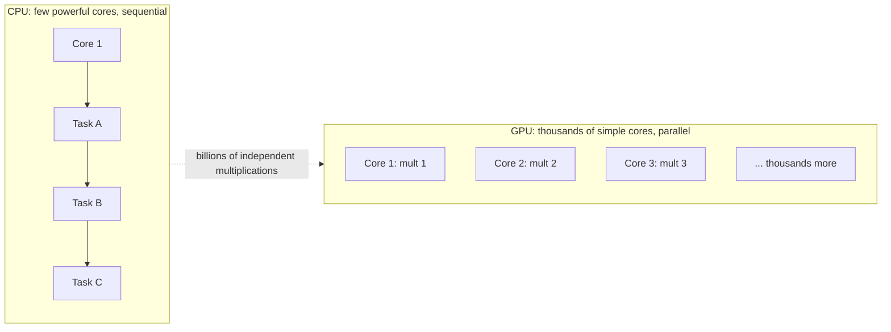
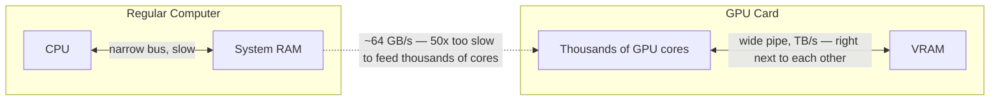
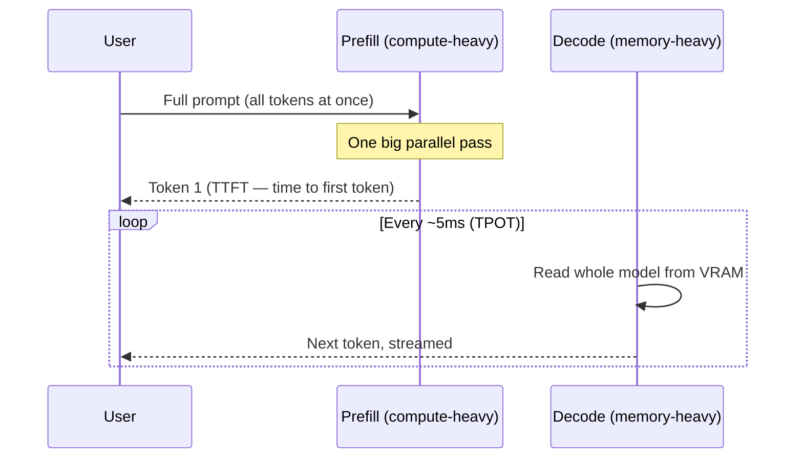
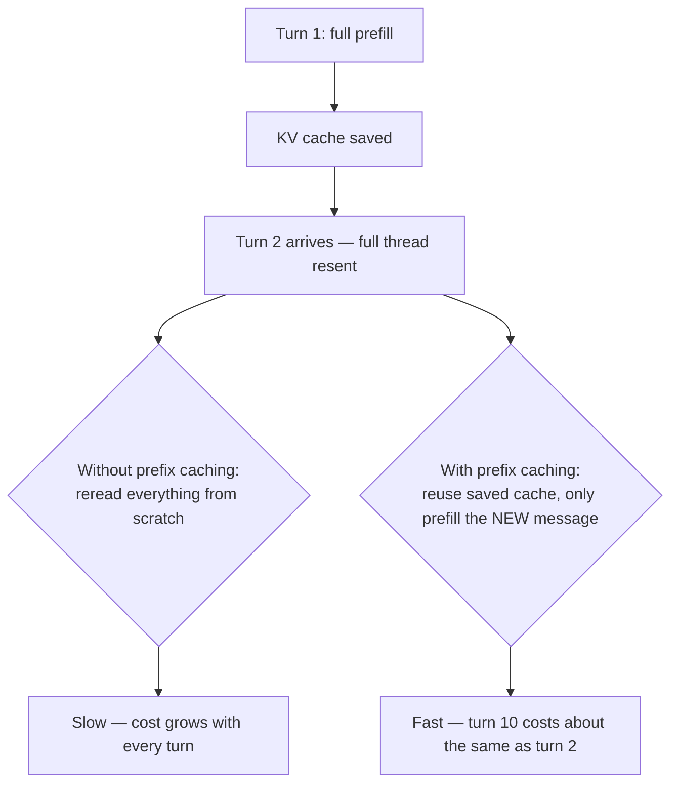
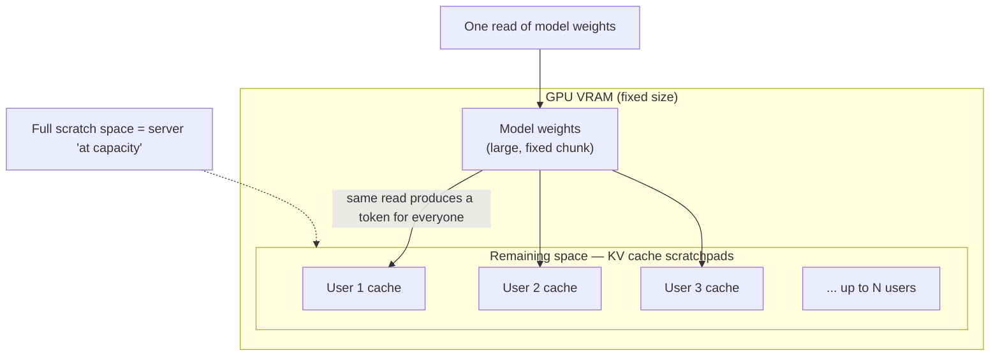
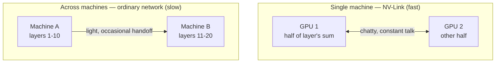
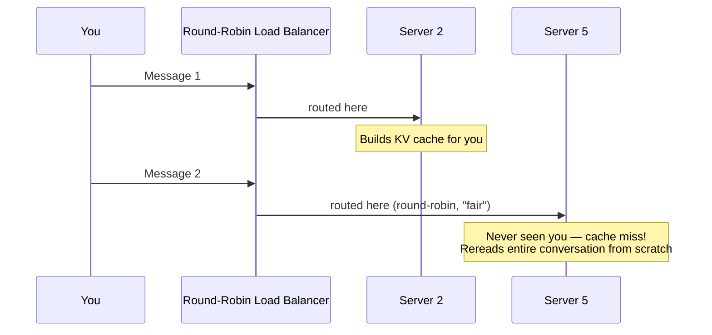
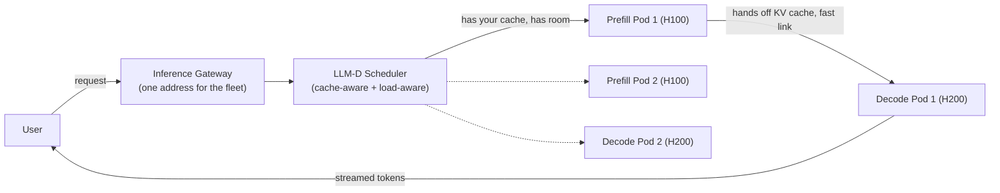

# The Infrastructure Behind AI: How ChatGPT Actually Runs

Every time someone types a question into ChatGPT and hits Enter, a huge amount of engineering — GPUs, memory, servers, and orchestration systems — kicks into gear behind the scenes. This article breaks that machinery down piece by piece, using simple examples so each concept is easy to picture.

---

## 1. What Is a "Model," Really?

Forget AI for a second. Imagine a tiny machine: you drop in a number, and a different number comes out.

- Input `3` → Output `6`
- Input `10` → Output `20`

It's just doubling. The rule hiding inside this machine — "multiply by 2" — is called a **weight**. If you change the weight from 2 to 3, the exact same machine now *triples* instead of doubling. Same structure (multiply the input), different number inside, completely different behavior.

**Example — predicting house prices:**
A real formula might look like:

```
price = (size × 300) + (bedrooms × 50,000) + (age × -1,000) + (location_score × 25,000)
```

Each of those numbers (300, 50,000, -1,000, 25,000) is a weight — it tells you how much that one factor matters. You don't invent these numbers by hand. You show the formula thousands of real houses with their actual sale prices, and a process works out which weights fit best. **That process of learning the weights from examples is called training.**

Language is far messier than house prices, so the formula has to grow — many more inputs, many more weights, stacked in layers where one layer's output feeds the next layer's input. Grow that in one very specific, repeating pattern, and you get the architecture behind every modern AI model: the **transformer**.

The transformer itself is just a page of code, and it's broadly the *same* structure across GPT, Claude, and Llama. What actually makes these models different from each other isn't the formula — **it's the weights.**

---

## 2. A Model Is Just a File on Disk

A real model doesn't have 4 weights or 400 — it has *billions*. All of those numbers, once trained, are saved to a file:

| Model size | Approximate file size |
|---|---|
| Small model | ~2 GB |
| Mid-size model | ~16 GB |
| Large model (70B parameters) | ~140 GB |
| Giant model (500B+ parameters) | Several hundred GB |

Running a model, at its simplest, is: **load the file into memory → feed it your text → the formula computes → you get text back.**

So if it's really just a file and some math... why can't you run a big model on your laptop?

---

## 3. Why a Laptop Can't Run a Big Model: CPU vs. GPU

Every computer has two important parts:

- **CPU** — the processor that does the actual thinking/calculating
- **RAM** — the memory that holds data the CPU is working on

These two are physically separate, connected by a narrow "road" (a bus). Every calculation is a round trip: numbers go into RAM, the CPU reads them, computes, and writes the answer back.

A CPU is a **brilliant generalist**: a handful of very powerful cores that work through complex tasks one after another. Perfect for browsers, apps, operating systems.

But running a model is, at its core, **billions of tiny multiplications that don't depend on each other** — they could all happen at the same time. A CPU, with its few sequential cores, chews through them one-by-one and you'd be waiting a very long time.

This is where the **GPU** comes in. It's built the opposite way: instead of a few powerful cores, it has *thousands* of small, simple cores that all do math simultaneously.

| | Operations per second (approx.) |
|---|---|
| CPU | ~10 trillion |
| GPU | ~1,000 trillion (100x more) |



### The New Problem: Feeding the GPU

A processor is useless without memory to feed it data — in this case, the model's billions of weights. If those weights sit in regular system RAM, there's a problem: system RAM connects to the GPU through a narrow pipe (~64 GB/s), roughly **50x slower** than what thousands of GPU cores can actually consume. The cores end up idle, starving for data.

**The fix:** give the GPU its own memory, built directly onto the card, right next to its cores. This is called **VRAM**, and it has a much wider pipe — measured in *terabytes* per second instead of gigabytes.

The catch: VRAM is fast, but small. A card like the Nvidia T4 has only 16 GB. A 70-billion-parameter model needs ~140 GB just to sit in memory — it won't fit on one card at all. (We'll come back to this — it's the reason "sharding" exists.)



### The Three Numbers That Size Every GPU

Every GPU you'll ever encounter is described by three numbers:

1. **Compute** — how much math it can do (TFLOPS)
2. **Capacity** — how much fits in its memory (GB of VRAM)
3. **Bandwidth** — how fast it can read its own memory (TB/s)

| Hardware | Compute (TFLOPS) | VRAM | Bandwidth |
|---|---|---|---|
| Desktop GPU | 1–3 | 32–64 GB | ~0.09 TB/s |
| Rack server | 5–10 | high | ~0.5 TB/s |
| Nvidia A100 | 312 | 80 GB | ~2 TB/s |
| Nvidia H100/H200 | 990 | 80 GB / 141 GB | higher |
| Nvidia B200 | ~2,250 | 192 GB | ~8 TB/s |

---

## 4. From Code to a Real Product: PyTorch and vLLM

**PyTorch** is the software that loads a model onto the GPU and puts all those cores to work — often in just a handful of lines of code: import the library, load the model, call `generate()`, get text back.

But that's a *script*. It runs once, for one person, and stops. Real products need something **always on**, listening for thousands of simultaneous requests. That's a **model server**.

**vLLM** is the model server this article keeps returning to. It wraps a model in a standard web API — and it speaks the *same format* as the OpenAI API, so any existing tool built for OpenAI can point at your own vLLM server without changing a line of code.

One catch: a single vLLM server holds the *entire model* in GPU memory the whole time it runs. Spinning up a second server means an entirely new copy of the model on another expensive GPU. Model servers are heavy, slow to start, and costly to duplicate.

---

## 5. Tokens: The Real Unit of Language Models

Language models don't read or write whole words — they break text into **tokens**, roughly ¾ of a word on average. "Serving LLMs is not like serving web apps" is 8 words but ~9 tokens.

Everything is measured in tokens: what the model can read, what you pay for, and how fast it generates a reply.

**The model has exactly one trick:** given all the text so far, predict the *next* token. It appends that token to the text, then predicts the next one, again and again, until the answer is complete. A 100-word answer isn't one big calculation — it's this loop running 100 times, one token per lap. **This is exactly why ChatGPT's answer appears to "type itself out"** — you're watching each lap of the loop finish, streamed to you live.

---

## 6. The Two Halves of Every Request: Prefill and Decode

When you paste a big prompt and hit Enter, there's a brief pause, then the answer streams out word by word. These are two genuinely different phases:

### Phase 1 — Prefill (the pause)
The model reads your *entire* prompt at once. Every token goes through the model together, in one big parallel burst — thousands of GPU cores fire simultaneously. This pass ends by producing the *first* token of the answer.

- **Metric: TTFT (Time To First Token)** — how long the prefill takes.
- Asking "capital of France?" (~7 tokens) → prefill is instant.
- Pasting a 100-page contract (tens of thousands of tokens) → prefill becomes a real, noticeable wait.
- This phase is **compute-heavy** (bottlenecked by how much math the GPU can do).

### Phase 2 — Decode (the stream)
This is the token-by-token loop. Here's the surprising part: **producing each new token requires reading the entire model out of VRAM**, even though the actual math per token is tiny. Writing a 200-token answer means loading the full model from memory 200 separate times.

- **Metric: TPOT (Time Per Output Token)** — the gap between tokens, e.g. one token every ~5 milliseconds.
- This phase is **memory-bandwidth-heavy**, not compute-heavy. A GPU reading VRAM at 3 TB/s, feeding a 16 GB model, tops out around 200 reads (tokens) per second — that ceiling is set purely by how fast memory can be read, not by raw compute power.

**Example (Rabbi's world):** this is conceptually similar to a cache-miss-bound service — your CPU/cores aren't the bottleneck, memory bandwidth is, the same way a poorly-indexed Postgres query is I/O-bound rather than CPU-bound.



---

## 7. KV Cache and Prefix Caching: Avoiding Repeated Work

If every new token required redoing the entire prefill from scratch, chat would be unusably slow. Instead, the expensive prefill work is **saved** the moment it's computed — this saved state is called the **KV cache**. From then on, the decode phase just reaches into the cache and adds one new token on top, instead of recomputing everything.

**But here's the catch across turns:** the moment your reply finishes, the KV cache is normally cleared. So when you send a *second* message, your chat app resends the *entire conversation* (message 1, answer 1, message 2...) as one new request — and since last turn's cache is gone, the server has to reread the whole thing from scratch. **The longer the conversation, the more expensive every new message becomes.**

**The fix — prefix caching:** instead of throwing the cache away, keep it, labeled by the exact text that produced it. On turn 10, the server realizes it already has the work done for everything except your newest message — so turn 10 costs about the same as turn 2. This is why Anthropic's API console has a feature called **prompt caching** — a cached input token costs roughly a tenth of a fresh one.

A bonus falls out for free: cached work only depends on the *text*, not who sent it. If your company's assistant always opens with the same long system prompt, that prefill work is computed once and reused for *every user* who talks to it — as long as their conversation starts with the same text.



---

## 8. Batching: Serving Many Users on One GPU

Recall: producing one decode token requires reading the *entire* model out of memory. That read is the expensive part. So — why not use that same read to generate a token for many users at once, instead of just one?

One read of the model → 1 token for 1 user, **or** 50 tokens for 50 users, at nearly the same memory cost. This is **batching**: pack many people's requests together and run them through the GPU as a group. Each person's individual reply comes at roughly the same speed, but the server's total **throughput** (tokens/second across everyone) shoots up dramatically — serving 50 people for close to the cost of serving one.

### What limits batching?
Not compute — the cores have plenty of spare capacity. It's **memory**. Every user in a batch needs their own KV cache "scratchpad" sitting in GPU memory for the whole time they're being served. The model's weights already occupy a fixed, large chunk of VRAM; whatever's left over is the only room available for everyone's scratchpads. Once that space fills up, new users wait in line — this is exactly why ChatGPT sometimes says it's "at capacity."



---

## 9. Sharding: Splitting Giant Models Across GPUs

Some models are simply too large for any single GPU — a 500B+ parameter model can be several hundred GB, but a GPU might only have 80 GB of VRAM. The answer: use *several* GPUs together, each holding a slice of the model. vLLM can do this automatically — you just tell it how many GPUs are available.

A model is a stack of layers, each layer a large formula. There are two ways to split it:

1. **By layer (pipeline-style):** GPU 1 handles the first few layers, GPU 2 handles the next few, and so on. The result flows down the chain.
2. **Within each layer (tensor-style, "the chatty method"):** a single layer's calculation is split into pieces — GPU 1 computes half the sum, GPU 2 computes the other half, and they combine the result. This requires constant communication between GPUs.

**Which one you use depends on the wire speed between the GPUs:**
- Inside a single machine, GPUs are connected by **NV-Link**, an extremely fast link — so the "chatty," within-layer split works great (this is how most large models run today, e.g. 8 GPUs in one box acting as one logical server).
- Across separate machines, only an ordinary (much slower) network connects them — so you switch to the "by layer" split, since it needs far less back-and-forth chatter.

**Rule of thumb: keep the chatty talk inside a box, keep the light talk between boxes.**



---

## 10. Why Ordinary Load Balancing Breaks for LLMs

You already know how to load balance a web service: put a load balancer in front of a fleet, and spread traffic evenly, round-robin. This has worked for decades — but for LLM serving, it's the wrong approach, for two reasons:

**Reason 1 — it throws away saved work.** Say your first message lands on Server 2, which builds up a KV cache for your conversation. Your next message, load-balanced "evenly," lands on Server 5 instead — which has never seen you before and must reread your entire conversation from scratch. The load balancer treats every server as interchangeable, but they're not: each one is holding different cached state.

**Reason 2 — it assumes every request is the same size.** A load balancer sees "one request" the same way whether it's "hello" or "summarize this 50-page contract." It might route that huge request to a server already streaming replies to 30 other people — slowing all 30 of them down. The load balancer has no visibility into what's happening *inside* each server: how full its memory is, whose cache lives where, or how long its queue is.



---

## 11. LLM-D: A Smart Router Built for LLMs

To solve this, Red Hat, Google, IBM, and Nvidia jointly built an open-source project called **LLM-D** — a router that sits in front of the fleet and actually reasons about where each request should go, based on three things:

1. **Saved work (KV cache location)** — routes your next message straight back to the server that already holds your conversation's cache, skipping the reread. This alone gives roughly **3x the throughput** and **2x faster first response** on the same hardware.
2. **Memory and queue state** — checks how full each server actually is and how long its queue is, instead of guessing.
3. **Prefill vs. decode separation** — since prefill (compute-heavy) and decode (memory-heavy) have very different hardware needs, LLM-D can route them to *separate pools of servers* — e.g., H100s (high compute) for prefill, H200s (high memory) for decode. When a prefill server finishes reading a prompt, it hands the cached state to a decode server over a fast link. This can yield **up to 70% more tokens/second** on the same hardware.

LLM-D runs on **Kubernetes** — the same platform ~66% of organizations running generative AI already use to manage inference workloads, according to a CNCF report.



### Kubernetes building blocks for LLM-D

- Each **vLLM instance** runs as a **pod**. A group of identical pods (e.g., the prefill pool, or the decode pool) is a **deployment**.
- An **inference gateway** sits in front of everything, giving you one address for the entire fleet, backed by the **LLM-D scheduler** — the "brain" applying cache-aware and load-aware routing logic.
- **For sharded giant models**, the pods spanning multiple machines aren't independent replicas (unlike, say, a MySQL StatefulSet where each pod is its own database node) — together they form *one logical server*. Kubernetes introduced a purpose-built object for this called a **LeaderWorkerSet**: a leader pod plus its worker pods, scaled and healed together as a single unit. If one shard dies, the whole group restarts together, because a model missing a piece can't answer anything.
- All of this is described in a `values.yaml` file passed to a Helm chart — defining the model's location, how many prefill pods, how many decode pods, and so on. Swap the file, get a different fleet.

Because it's all just Kubernetes objects underneath, the normal Kubernetes reconciliation loop applies: a pod crashes → Kubernetes restarts it; a machine dies → Kubernetes reschedules those pods elsewhere; and since prefill and decode pools are separate, you can scale each independently based on its own bottleneck.

### "Well-Lit Paths" — pre-tuned deployment recipes

LLM-D exposes many tunable knobs (how strongly to favor cache-locality vs. load, whether to split prefill/decode, how many GPUs per model shard, batch sizes). Tuning all of this by hand could take weeks. LLM-D ships **ready-made recipes**, each already tuned on real hardware:

1. **Optimized baseline** — one pool of identical servers with cache-aware routing on, nothing else changed. Smallest change, biggest initial payoff — most teams start here.
2. **Prefill/decode disaggregation** — separate pools for reading prompts vs. writing answers, sized independently. Best for workloads with long, heavy prompts.
3. **Wide sharding** — a single giant model spread across a group of GPUs acting as one server.

The router logic stays identical across all three — only the shape of the underlying fleet changes.

---

## 12. Putting It All Together

When you send a request to a well-built LLM inference cluster, here's the full journey:

1. Your request hits the **gateway**.
2. The **LLM-D scheduler** picks the pod that already holds your cached conversation state (or the least-loaded suitable one).
3. A **prefill** pod reads your prompt in one parallel compute-heavy burst → produces the first token (**TTFT**).
4. A **decode** pod streams the rest of the answer, one token at a time, reading the full model from VRAM on every step (**TPOT**), reusing the **KV cache** so it never reprocesses earlier text.
5. If the model is a giant, this all happens across a **sharded** group of GPUs acting as one logical unit.
6. Many other users' requests are **batched** onto the same GPUs simultaneously, multiplying throughput without multiplying hardware cost.

None of this is machine learning in the traditional sense — it's infrastructure engineering: pods, deployments, routing, caching, autoscaling, memory management, and networking. The models change fast, but the discipline underneath — Linux, containers, Kubernetes, monitoring, and systems thinking — is exactly the skill set backend and DevOps engineers already build every day.